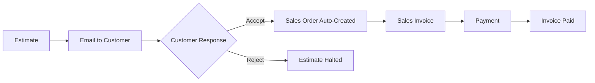
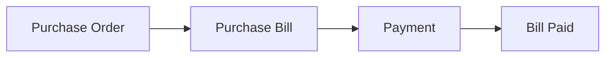

# Idli Book - Complete System Documentation

> **Version**: 1.0.2  
> **Last Updated**: January 19, 2026  
> **Total DocTypes**: 29 | **Reports**: 27 | **Workspaces**: 14 | **Dashboard Charts**: 7 | **Number Cards**: 11

---

## Table of Contents

1. [Module Overview](#1-module-overview)
2. [DocTypes Reference](#2-doctypes-reference)
3. [Reports Documentation](#3-reports-documentation)
4. [Dashboard Charts](#4-dashboard-charts)
5. [Number Cards](#5-number-cards)
6. [Workspaces Guide](#6-workspaces-guide)
7. [Chart of Accounts](#7-chart-of-accounts)
8. [APIs & Features](#8-apis--features)
9. [AI Chatbot Assistant](#9-ai-chatbot-assistant)
10. [Tax & Calculations](#10-tax--calculations)
11. [Workflows](#11-workflows)
12. [Scheduler Tasks](#12-scheduler-tasks)
13. [Installation & Setup](#13-installation--setup)

---

## 1. Module Overview

Idli Book is a minimal yet powerful accounting application built on the Frappe Framework. It provides essential features for managing sales, purchases, inventory, and accounts without the complexity of full-featured ERP systems.

### Core Modules

| Module | Purpose | Key Features |
|--------|---------|--------------|
| **Sales** | Manage customer transactions | Estimates, Sales Orders, Sales Invoices |
| **Purchase** | Handle vendor transactions | Purchase Orders, Purchase Bills |
| **Inventory** | Track stock levels | Item management, stock tracking |
| **Accounting** | Financial management | Chart of Accounts, Journal Entries, GL |
| **Payments** | Payment processing | UPI QR Codes, Payment tracking |
| **Reports** | Business intelligence | 27 Financial & operational reports |
| **AI Chatbot** | Natural language assistant | Query data using Gemini AI |

### Architecture Overview

```
idli_book/
├── idli_book/
│   ├── ai/                    # AI Chatbot (Gemini integration)
│   │   ├── llm_provider.py    # LLM API wrapper
│   │   └── action_executor.py # Business function definitions
│   ├── api/                   # REST APIs
│   │   ├── chatbot.py         # Chat endpoint
│   │   ├── workflow.py        # Estimate workflow (Accept/Reject)
│   │   ├── email_tracker.py   # Email status tracking
│   │   ├── hsn_data.py        # HSN code data
│   │   └── tax_api.py         # Tax calculations
│   ├── idli_book/
│   │   ├── doctype/           # 29 DocTypes
│   │   ├── report/            # 27 Reports
│   │   ├── workspace/         # 14 Workspaces
│   │   ├── dashboard_chart/   # 7 Dashboard Charts
│   │   ├── number_card/       # 11 Number Cards
│   │   ├── page/              # 4 Custom Pages
│   │   └── www/               # Public web pages
│   ├── utils/                 # Utility functions
│   ├── templates/             # Email templates
│   ├── public/                # Static assets
│   └── www/                   # Public pages (invoice_payment)
└── docs/                      # Documentation
```

---

## 2. DocTypes Reference

**Total DocTypes: 29**

### DocType Summary

| Category | Count | DocTypes |
|----------|-------|----------|
| Core Masters | 3 | IB Currency, IB UOM, IB Country |
| Master Data | 10 | IB Organization, IB Customer, IB Vendor, IB Item, IB Tax, IB State, IB HSN Code, IB SAC Code, IB Chatbot Settings, IB Payment Settings |
| Transactions | 9 | IB Estimate, IB Sales Order, IB Sales Invoice, IB Purchase Order, IB Purchase Bill, IB Credit Note, IB Debit Note, IB Payment, IB Journal Entry |
| Accounting | 2 | IB Chart of Accounts, IB GL Entry |
| Child Tables | 4 | IB Invoice Item, IB Purchase Item, IB Payment Reference, IB Journal Entry Account |

---

### 2.1 Core Master DocTypes

#### IB Currency
**Purpose**: Independent currency master (no external dependencies).

| Field Name | Type | Purpose |
|------------|------|---------|
| `currency_code` | Data | ISO 4217 code (e.g., INR, USD) - Naming field |
| `currency_name` | Data | Full currency name |
| `symbol` | Data | Currency symbol |
| `fraction` | Data | Smallest unit name |
| `number_format` | Data | Display format pattern |
| `smallest_currency_fraction_value` | Float | Minimum decimal value |
| `is_active` | Check | Enable/disable |

**Pre-loaded Data**: 50+ global currencies including INR, USD, EUR, GBP, JPY, CNY, AED, and more.

---

#### IB UOM
**Purpose**: Unit of Measurement master (independent).

| Field Name | Type | Purpose |
|------------|------|---------|
| `uom_name` | Data | UOM name - Naming field |
| `uom_abbreviation` | Data | Short form (e.g., Kg, Ltr) |
| `uom_type` | Select | Quantity/Weight/Length/Volume/Area/Time/Other |
| `is_active` | Check | Enable/disable |

**Pre-loaded Data**: 17 common UOMs (Nos, Kg, Ltr, Box, Meter, etc.)

---

#### IB Country
**Purpose**: Country master (independent).

| Field Name | Type | Purpose |
|------------|------|---------|
| `country_name` | Data | Country name - Naming field |
| `country_code` | Data | ISO 3166-1 alpha-2 code |
| `is_active` | Check | Enable/disable |

**Pre-loaded Data**: 60 major countries worldwide.

---

### 2.2 Master Data DocTypes

#### IB Organization
**Purpose**: Single DocType storing organization-level settings and defaults.

| Field Name | Type | Purpose | Links To |
|------------|------|---------|----------|
| `organization_name` | Data | Company name | - |
| `gstin` | Data | GST Number | - |
| `address_line1` | Data | Address | - |
| `address_line2` | Data | Address continuation | - |
| `city` | Data | City | - |
| `state` | Link | State | IB State |
| `country` | Link | Country | IB Country |
| `pincode` | Data | PIN Code | - |
| `email` | Data | Organization email | - |
| `phone` | Data | Contact number | - |
| `base_currency` | Link | Default currency | IB Currency |
| `financial_year_start` | Date | FY start date | - |
| `financial_year_end` | Date | FY end date | - |
| `default_receivable_account` | Link | AR default | IB Chart of Accounts |
| `default_payable_account` | Link | AP default | IB Chart of Accounts |
| `default_income_account` | Link | Income default | IB Chart of Accounts |
| `default_expense_account` | Link | Expense default | IB Chart of Accounts |
| `default_bank_account` | Link | Bank default | IB Chart of Accounts |

**Key Features**:
- Single record for entire organization
- Provides defaults for all financial transactions
- Links to master Chart of Accounts

---

#### IB Customer
**Purpose**: Store customer master data and defaults.

| Field Name | Type | Purpose | Links To |
|------------|------|---------|----------|
| `customer_name` | Data | Customer display name | - |
| `email` | Data | Contact email | - |
| `phone` | Data | Phone number | - |
| `gstin` | Data | Customer GST number | - |
| `billing_address` | Text | Billing address | - |
| `shipping_address` | Text | Shipping address (if different) | - |
| `city` | Data | City | - |
| `state` | Link | State | IB State |
| `pincode` | Data | PIN Code | - |
| `default_receivable_account` | Link | Customer AR account | IB Chart of Accounts |
| `credit_limit` | Currency | Maximum credit allowed | - |
| `payment_terms` | Data | Payment terms | - |

**Auto-Creation Feature**:
- When saved, automatically creates a dedicated receivable account: `[Customer Name] - Receivable`
- Links this account to the customer record

---

#### IB Vendor
**Purpose**: Store vendor/supplier master data.

| Field Name | Type | Purpose | Links To |
|------------|------|---------|----------|
| `vendor_name` | Data | Vendor display name | - |
| `email` | Data | Contact email | - |
| `phone` | Data | Phone number | - |
| `gstin` | Data | Vendor GST number | - |
| `address` | Text | Vendor address | - |
| `city` | Data | City | - |
| `state` | Link | State | IB State |
| `pincode` | Data | PIN Code | - |
| `default_payable_account` | Link | Vendor AP account | IB Chart of Accounts |
| `payment_terms` | Data | Payment terms | - |

**Auto-Creation Feature**:
- Creates dedicated payable account: `[Vendor Name] - Payable`
- Auto-links to vendor record

---

#### IB Item
**Purpose**: Product/Service master with inventory tracking.

| Field Name | Type | Purpose | Links To |
|------------|------|---------|----------|
| `item_name` | Data | Product/service name | - |
| `item_code` | Data | Unique identifier | - |
| `description` | Text | Item description | - |
| `item_type` | Select | Product/Service | - |
| `track_inventory` | Check | Enable stock tracking | - |
| `current_stock` | Float | Available quantity | - |
| `reorder_level` | Float | Low stock alert level | - |
| `unit_of_measurement` | Link | UOM | IB UOM |
| `standard_rate` | Currency | Selling price | - |
| `purchase_rate` | Currency | Buy price | - |
| `hsn_code` | Link | HSN/SAC code | IB HSN Code |
| `tax_rate` | Float | Applicable GST % | - |
| `is_active` | Check | Active status | - |

**Inventory Tracking**:
- Stock updated on Sales Invoice/Purchase Bill submission
- Debit Note/Credit Note reverse stock movements

---

#### IB Chatbot Settings
**Purpose**: AI Chatbot configuration (Single DocType).

| Field Name | Type | Purpose |
|------------|------|---------|
| `enable_chatbot` | Check | Enable/disable chatbot |
| `llm_provider` | Select | Google Gemini / OpenAI |
| `model` | Data | Model name (blank for auto-discovery) |
| `api_key` | Password | LLM API key |

**Configuration**:
- Set `llm_provider` to "Google Gemini"
- Leave `model` blank for automatic best model selection
- Enter your Gemini API key from [Google AI Studio](https://aistudio.google.com/apikey)

---

#### IB Payment Settings
**Purpose**: Payment gateway and UPI configuration (Single DocType).

| Field Name | Type | Purpose |
|------------|------|---------|
| `enable_payment_gateway` | Check | Enable Razorpay |
| `razorpay_key_id` | Data | API Key |
| `razorpay_key_secret` | Password | API Secret |
| `enable_upi_qr` | Check | Enable UPI QR |
| `upi_id` | Data | UPI VPA |
| `payee_name` | Data | UPI payee name |

---

#### IB Tax
**Purpose**: Tax rate master (CGST, SGST, IGST).

| Field Name | Type | Purpose |
|------------|------|---------|
| `tax_name` | Data | Tax name |
| `tax_rate` | Float | Tax percentage |
| `account` | Link | Tax GL account |

---

#### IB State
**Purpose**: State master for GST (CGST+SGST vs IGST logic).

| Field Name | Type | Purpose |
|------------|------|---------|
| `state_name` | Data | State name |
| `state_code` | Data | GST state code |

---

#### IB HSN Code / IB SAC Code
**Purpose**: HSN/SAC code masters for GST compliance.

| Field Name | Type | Purpose |
|------------|------|---------|
| `code` | Data | HSN/SAC code |
| `description` | Text | Code description |
| `tax_rate` | Float | Default tax rate |

---

### 2.3 Transaction DocTypes

#### IB Estimate
**Purpose**: Quotation/Proforma invoice for customers with email workflow.

| Field Name | Type | Purpose | Links To |
|------------|------|---------|----------|
| `customer` | Link | Customer | IB Customer |
| `estimate_date` | Date | Quote date | - |
| `valid_till` | Date | Validity period | - |
| `status` | Select | Draft/Submitted/Accepted/Halted/Cancelled/Ordered | - |
| `customer_opinion` | Select | Pending/Accepted/Declined | - |
| `items` | Table | Line items | IB Invoice Item |
| `subtotal` | Currency | Pre-tax total | - |
| `tax_total` | Currency | Total tax | - |
| `grand_total` | Currency | Final amount | - |
| `notes` | Text | Terms & conditions | - |
| `email_delivery_status` | Data | Email sent status | - |

**Status Flow**: Draft → Submitted → Accepted/Halted → Ordered/Cancelled

**Email Workflow Features**:
- Auto-sends approval email on submit
- Customer can Accept or Reject via secure email links
- Accepted estimates auto-create Sales Orders
- Token-based security for email links

---

#### IB Sales Order
**Purpose**: Confirmed customer order.

| Field Name | Type | Purpose | Links To |
|------------|------|---------|----------|
| `customer` | Link | Customer | IB Customer |
| `order_date` | Date | SO date | - |
| `delivery_date` | Date | Expected delivery | - |
| `status` | Select | Draft/Confirmed/Billed | - |
| `items` | Table | Line items | IB Invoice Item |
| `subtotal` | Currency | Pre-tax total | - |
| `tax_total` | Currency | Total tax | - |
| `grand_total` | Currency | Final amount | - |
| `estimate_ref` | Link | Source estimate (optional) | IB Estimate |

**Status Flow**: Draft → Confirmed → Billed (via Sales Invoice)

---

#### IB Sales Invoice
**Purpose**: Final bill to customer with accounting integration.

| Field Name | Type | Purpose | Links To |
|------------|------|---------|----------|
| `customer` | Link | Customer | IB Customer |
| `invoice_date` | Date | Invoice date | - |
| `due_date` | Date | Payment due date | - |
| `status` | Select | Draft/Submitted/Paid/Partial | - |
| `items` | Table | Line items | IB Invoice Item |
| `subtotal` | Currency | Pre-tax total | - |
| `tax_total` | Currency | Total tax | - |
| `grand_total` | Currency | Final amount | - |
| `paid_amount` | Currency | Amount received | - |
| `outstanding_amount` | Currency | Balance due | - |
| `sales_order` | Link | Source SO (optional) | IB Sales Order |
| `email_delivery_status` | Data | Email sent status | - |

**Key Features**:
- Creates GL entries on submission (DR: AR, CR: Income + Tax)
- Updates stock for tracked items
- Sends email with UPI payment link
- Auto-updates status based on payments

---

#### IB Purchase Order
**Purpose**: Order placed with vendor.

| Field Name | Type | Purpose | Links To |
|------------|------|---------|----------|
| `vendor` | Link | Vendor | IB Vendor |
| `order_date` | Date | PO date | - |
| `delivery_date` | Date | Expected delivery | - |
| `status` | Select | Draft/Confirmed/Billed | - |
| `items` | Table | Line items | IB Purchase Item |
| `subtotal` | Currency | Pre-tax total | - |
| `tax_total` | Currency | Total tax | - |
| `grand_total` | Currency | Final amount | - |

---

#### IB Purchase Bill
**Purpose**: Vendor invoice with accounting integration.

| Field Name | Type | Purpose | Links To |
|------------|------|---------|----------|
| `vendor` | Link | Vendor | IB Vendor |
| `bill_date` | Date | Bill date | - |
| `due_date` | Date | Payment due date | - |
| `status` | Select | Status | - |
| `items` | Table | Line items | IB Purchase Item |
| `subtotal` | Currency | Pre-tax total | - |
| `tax_total` | Currency | Total tax | - |
| `grand_total` | Currency | Final amount | - |
| `paid_amount` | Currency | Amount paid | - |
| `outstanding_amount` | Currency | Balance | - |
| `purchase_order` | Link | Source PO (optional) | IB Purchase Order |

**Key Features**:
- Creates GL entries: DR: Expense + Tax, CR: AP
- Updates stock for tracked items

---

#### IB Credit Note
**Purpose**: Sales return/reversal document.

| Field Name | Type | Purpose | Links To |
|------------|------|---------|----------|
| `customer` | Link | Customer | IB Customer |
| `sales_invoice` | Link | Original invoice | IB Sales Invoice |
| `credit_note_date` | Date | CN date | - |
| `items` | Table | Return items | IB Invoice Item |
| `total_amount` | Currency | Credit amount | - |
| `reason` | Text | Return reason | - |

**Effects**:
- Reverses Sales Invoice GL entries
- Reduces receivable
- Reverses stock (if tracked)

---

#### IB Debit Note
**Purpose**: Purchase return/reversal document.

| Field Name | Type | Purpose | Links To |
|------------|------|---------|----------|
| `vendor` | Link | Vendor | IB Vendor |
| `purchase_bill` | Link | Original bill | IB Purchase Bill |
| `debit_note_date` | Date | DN date | - |
| `items` | Table | Return items | IB Purchase Item |
| `total_amount` | Currency | Debit amount | - |
| `reason` | Text | Return reason | - |

**Effects**:
- Reverses Purchase Bill GL entries
- Reduces payable
- Reverses stock (if tracked)

---

### 2.4 Accounting DocTypes

#### IB Chart of Accounts
**Purpose**: Ledger account master.

| Field Name | Type | Purpose | Links To |
|------------|------|---------|----------|
| `account_name` | Data | Account name (also ID) | - |
| `account_number` | Data | Account code | - |
| `account_type` | Select | Asset/Liability/Income/Expense/etc. | - |
| `root_type` | Select | Balance Sheet / P&L | - |
| `is_group` | Check | Group/Ledger | - |
| `parent_account` | Link | Parent group | IB Chart of Accounts |

**Account Types**:
- Asset, Liability, Equity, Income, Expense
- Bank, Cash, Receivable, Payable
- Tax

**Auto-Creation**:
- Customer receivable accounts
- Vendor payable accounts

---

#### IB GL Entry
**Purpose**: General ledger transaction record.

| Field Name | Type | Purpose | Links To |
|------------|------|---------|----------|
| `posting_date` | Date | Transaction date | - |
| `account` | Link | Account affected | IB Chart of Accounts |
| `debit` | Currency | Debit amount | - |
| `credit` | Currency | Credit amount | - |
| `voucher_type` | Link | Source DocType | - |
| `voucher_no` | Dynamic Link | Source document | - |
| `remarks` | Text | Description | - |
| `is_cancelled` | Check | Reversal flag | - |

**Created By**:
- Sales Invoice
- Purchase Bill
- Payment Entry
- Journal Entry
- Debit/Credit Notes

---

#### IB Payment
**Purpose**: Customer/Vendor payment record.

| Field Name | Type | Purpose | Links To |
|------------|------|---------|----------|
| `payment_type` | Select | Receive/Pay | - |
| `party_type` | Select | Customer/Vendor | - |
| `party` | Dynamic Link | Customer/Vendor | IB Customer/Vendor |
| `payment_date` | Date | Payment date | - |
| `amount` | Currency | Payment amount | - |
| `mode_of_payment` | Select | Cash/Bank/UPI | - |
| `reference_no` | Data | Cheque/UTR number | - |
| `paid_from_account` | Link | Source account (for Pay) | IB Chart of Accounts |
| `paid_to_account` | Link | Destination account (for Receive) | IB Chart of Accounts |
| `references` | Table | Invoice allocations | IB Payment Reference |

**Key Features**:
- Creates GL entries: DR/CR based on payment type
- Updates invoice `paid_amount` and `outstanding_amount`
- Updates invoice status (Paid/Partially Paid)

---

#### IB Journal Entry
**Purpose**: Manual accounting adjustments.

| Field Name | Type | Purpose | Links To |
|------------|------|---------|----------|
| `posting_date` | Date | JE date | - |
| `voucher_type` | Select | Journal Entry type | - |
| `accounts` | Table | Account entries | IB Journal Entry Account |
| `total_debit` | Currency | Sum of debits | - |
| `total_credit` | Currency | Sum of credits | - |
| `remarks` | Text | Description | - |

**Child Table (IB Journal Entry Account)**:
- `account`: Link to IB Chart of Accounts
- `debit`: Debit amount
- `credit`: Credit amount

---

### 2.5 Child Table DocTypes

#### IB Invoice Item
**Child of**: Estimate, Sales Order, Sales Invoice, Credit Note

| Field Name | Type | Purpose | Links To |
|------------|------|---------|----------|
| `item` | Link | Product/Service | IB Item |
| `description` | Text | Item description | - |
| `quantity` | Float | Qty | - |
| `rate` | Currency | Unit price | - |
| `amount` | Currency | Line total (qty × rate) | - |
| `tax_rate` | Float | GST % | - |
| `tax_amount` | Currency | Tax value | - |

---

#### IB Purchase Item
**Child of**: Purchase Order, Purchase Bill, Debit Note

Similar to IB Invoice Item, tailored for purchase documents.

---

#### IB Payment Reference
**Child of**: IB Payment

| Field Name | Type | Purpose | Links To |
|------------|------|---------|----------|
| `reference_doctype` | Link | Invoice type | DocType |
| `reference_name` | Dynamic Link | Invoice ID | Sales Invoice/Purchase Bill |
| `allocated_amount` | Currency | Payment allocation | - |
| `outstanding_amount` | Currency | Invoice balance | - |

---

#### IB Journal Entry Account
**Child of**: IB Journal Entry

| Field Name | Type | Purpose | Links To |
|------------|------|---------|----------|
| `account` | Link | Account | IB Chart of Accounts |
| `debit` | Currency | Debit amount | - |
| `credit` | Currency | Credit amount | - |

---

## 3. Reports Documentation

**Total Reports: 27**

### 3.1 Financial Reports

#### IB Profit and Loss
- **Type**: Script Report
- **Purpose**: Income Statement
- **Columns**: Account, Debit, Credit, Balance
- **Filters**: From Date, To Date
- **Logic**: Summarizes Income and Expense accounts

---

#### IB Balance Sheet
- **Type**: Script Report
- **Purpose**: Financial position statement
- **Columns**: Account, Amount
- **Filters**: As On Date
- **Logic**: Assets = Liabilities + Equity

---

#### IB Trial Balance
- **Type**: Script Report  
- **Purpose**: Account-wise debit/credit summary
- **Columns**: Account, Opening, Debit, Credit, Closing
- **Filters**: From Date, To Date

---

### 3.2 Sales Reports

#### IB Sales Invoice Status
- **Type**: Query Report
- **Purpose**: Invoice tracking
- **Columns**: Invoice, Customer, Date, Amount, Paid, Outstanding, Status
- **Summary**: Total Outstanding

---

#### IB Estimate Status
- **Type**: Query Report
- **Purpose**: Quote tracking
- **Columns**: Estimate, Customer, Date, Amount, Status, Valid Till

---

#### IB Best Selling Product
- **Type**: Script Report
- **Purpose**: Top-selling items
- **Columns**: Item, Qty Sold, Revenue
- **Filters**: From Date, To Date

---

#### IB Customer Payment Status
- **Type**: Query Report
- **Purpose**: AR aging
- **Columns**: Customer, Total Invoiced, Paid, Outstanding

---

#### IB Customer Growth
- **Type**: Script Report
- **Purpose**: Customer acquisition trends with chart
- **Columns**: Period, New Customers, Total Customers, Growth Rate, Active Customers
- **Filters**: From Date, To Date, Period (Monthly/Quarterly/Yearly)
- **Chart**: Mixed chart with bars (new) and lines (total/active)

---

#### IB Total Customer Growth
- **Type**: Script Report
- **Purpose**: Extended customer growth metrics

---

#### IB Total Sales Order Status
- **Type**: Query Report
- **Purpose**: Sales order tracking

---

### 3.3 Purchase Reports

#### IB Purchase Order Status
- **Type**: Query Report
- **Purpose**: PO tracking
- **Columns**: PO, Vendor, Date, Amount, Status

---

#### IB Purchase Bill Status
- **Type**: Query Report
- **Purpose**: Bill tracking
- **Columns**: Bill, Vendor, Date, Amount, Paid, Outstanding, Status

---

#### IB Vendor Payment Status
- **Type**: Query Report
- **Purpose**: AP aging
- **Columns**: Vendor, Total Billed, Paid, Outstanding

---

#### IB Total Purchased Products
- **Type**: Query Report
- **Purpose**: Purchase analysis
- **Columns**: Item, Qty Purchased, Total Cost

---

### 3.4 Inventory Reports

#### IB Inventory Tracked Items
- **Type**: Query Report
- **Purpose**: Current stock levels
- **Columns**: Item, UOM, Stock, Reorder Level

---

#### IB Low Stock Items
- **Type**: Query Report
- **Purpose**: Reorder alerts
- **Columns**: Item, Current Stock, Reorder Level
- **Filter**: Stock < Reorder Level

---

### 3.5 Summary Reports

| Report | Purpose | Type |
|--------|---------|------|
| IB Total Customers | Customer count | Script Report |
| IB Total Vendors | Vendor count | Script Report |
| IB Total Items | Item count | Script Report |
| IB Total Estimates | Estimate count | Script Report |
| IB Total Sales Orders | SO count | Script Report |
| IB Total Income | Revenue total | Script Report |
| IB Total Expenses | Expense total | Script Report |
| IB Total Receivables | AR total | Script Report |
| IB Total Amount Payable | AP total | Script Report |
| IB Top 5 Expenses | Expense breakdown | Script Report |

---

## 4. Dashboard Charts

**Total Dashboard Charts: 7**

Dashboard charts provide visual insights on the main Idli Book workspace.

| Chart Name | Purpose | Chart Type |
|------------|---------|------------|
| **Cash Flow** | Track cash inflows/outflows | Line/Bar |
| **Customer Trend Chart** | Customer growth over time | Line |
| **Payment Receive** | Payment receipt trends | Bar |
| **Purchase Order Status** | PO status breakdown | Pie/Donut |
| **Sales Invoice** | Invoice status/amounts | Bar |
| **Sales Order Trends** | SO trends over time | Line |
| **Top 5 Expense** | Top expense categories | Bar |

---

## 5. Number Cards

**Total Number Cards: 11**

Number cards display key metrics at a glance on workspaces.

| Card Name | Metric | Location |
|-----------|--------|----------|
| **Total Customers** | Count of IB Customer | Dashboard |
| **Total Items** | Count of IB Item | Dashboard |
| **Total Sales Order** | Count of IB Sales Order | Dashboard |
| **Vendors** | Count of IB Vendor | Dashboard |
| **Purchased Products** | Total purchased items | Dashboard |
| **IB Total Payables** | Total AP amount | Dashboard |
| **IB Total Receivables** | Total AR amount | Dashboard |
| **Payable Amount** | Outstanding payables | Dashboard |
| **Payment Receivable** | Outstanding receivables | Dashboard |
| **IB Top Expense Item** | Highest expense item | Dashboard |
| **Top 5 Expense** | Top 5 expenses display | Dashboard |

---

## 6. Workspaces Guide

**Total Workspaces: 14**

### Idli Book (Main)
- **Purpose**: Central dashboard
- **Quick Access**: Recent transactions, shortcuts
- **Charts**: Revenue, Expenses, Cash Flow
- **Number Cards**: Key metrics at a glance

### Sales
- **Shortcuts**: Estimate, Sales Order, Sales Invoice, Customer
- **Reports**: Sales Invoice Status, Customer Payment Status

### Purchase
- **Shortcuts**: Purchase Order, Purchase Bill, Vendor
- **Reports**: Purchase Bill Status, Vendor Payment Status

### Items
- **Shortcuts**: New Item
- **Reports**: Inventory, Low Stock

### Payment / Receive / Pay
- **Shortcuts**: Record Payment, Record Receipt
- **Reports**: Payment tracking

### Customers / Vendors
- **Shortcuts**: Add new
- **Reports**: Aging, payment status

### Transaction Workspaces
| Workspace | Purpose | Key Features |
|-----------|---------|--------------|
| Bills | Purchase Bills management | List view, filters, bulk actions |
| Purchase Orders | PO management | List view, filters |
| Sales Invoices | Invoice management | List view, filters |
| Sales Orders | SO management | List view, filters |
| Estimates | Quote management | List view, filters |

---

## 7. Chart of Accounts

### Account Structure

```
Root
├── Assets
│   ├── Current Assets
│   │   ├── Cash
│   │   ├── Bank Accounts
│   │   └── Accounts Receivable
│   │       └── [Customer Name] - Receivable (auto-created)
│   └── Fixed Assets
├── Liabilities
│   ├── Current Liabilities
│   │   ├── Accounts Payable
│   │   │   └── [Vendor Name] - Payable (auto-created)
│   │   └── Tax Payable
│   │       ├── CGST Payable
│   │       ├── SGST Payable
│   │       └── IGST Payable
│   └── Long-term Liabilities
├── Equity
│   └── Opening Balance Equity
├── Income
│   ├── Sales Income
│   └── Other Income
└── Expense
    ├── Cost of Goods Sold
    ├── Operating Expenses
    └── Tax Expenses
```

### Auto-Created Accounts

#### Customer Receivable Accounts
- **Format**: `[Customer Name] - Receivable`
- **Created**: On customer save
- **Type**: Receivable (Asset)
- **Linked to**: Customer record

#### Vendor Payable Accounts
- **Format**: `[Vendor Name] - Payable`
- **Created**: On vendor save
- **Type**: Payable (Liability)
- **Linked to**: Vendor record

### Default Accounts (IB Organization)

| Setting | Purpose | Example |
|---------|---------|---------|
| Default Receivable | AR for customers without specific account | Accounts Receivable |
| Default Payable | AP for vendors without specific account | Accounts Payable |
| Default Income | Revenue recognition | Sales Income |
| Default Expense | Expense recognition | Operating Expenses |
| Default Bank Account | Payment processing | Main Bank Account |

---

## 8. APIs & Features

### 8.1 UPI QR Code Payment

**Implementation**: `www/invoice_payment.py`, `www/invoice_payment.html`

**Flow**:
1. Customer receives invoice email with "Pay Now" button
2. Clicks button → Opens `/invoice_payment?invoice=INV-001`
3. Page generates dynamic UPI QR code:
   ```
   upi://pay?pa={upi_id}&pn={payee_name}&tr={invoice_name}&tn=Invoice {invoice_name}&am={amount}&cu=INR
   ```
4. Customer scans with any UPI app (GPay, PhonePe, etc.)
5. Payment pre-filled, customer completes

**Configuration** (IB Payment Settings):
- Enable UPI QR Code: ✓
- UPI ID (VPA): `business@okicici`
- Payee Name: `Your Company Name`

**Dependencies**:
- Python library: `qrcode[pil]`
- Install: `./env/bin/pip install qrcode[pil]`

**Code Reference**:
```python
# Generate QR
upi_uri = f"upi://pay?pa={upi_id}&pn={payee_name}&tr={invoice.name}&tn=Invoice {invoice.name}&am={amount}&cu=INR"
qr = qrcode.QRCode(version=1, box_size=10, border=4)
qr.add_data(upi_uri)
qr.make(fit=True)
img = qr.make_image(fill_color="black", back_color="white")
```

---

### 8.2 Estimate Workflow API

**Implementation**: `api/workflow.py`

**Purpose**: Allow customers to Accept or Reject estimates directly from email links.

**Endpoint**:
```
/api/method/idli_book.idli_book.api.workflow.handle_estimate_response
```

**Parameters**:
- `name`: Estimate ID (e.g., EST-0001)
- `action`: "accept" or "reject"
- `token`: Security token (hash of name + creation)

**Actions**:

**Accept**:
1. Updates estimate status to "Accepted"
2. Sets `customer_opinion` to "Accepted"
3. Auto-creates Sales Order from estimate
4. Adds comment to estimate

**Reject**:
1. Updates estimate status to "Halted"
2. Sets `customer_opinion` to "Declined"
3. Adds comment to estimate

**Security**:
- Token-based verification (hash of estimate name + creation timestamp)
- Prevents tampering with links
- Single-use validation (cannot accept/reject already actioned estimates)

---

### 8.3 Razorpay Integration (Optional)

**Implementation**: `api.py`, `www/pay.html`, `www/pay.py`

**APIs**:
- `get_payment_details(invoice_name)`: Fetch invoice info
- `create_razorpay_order(invoice_name)`: Create payment order
- `verify_payment(...)`: Verify signature & record payment

**Configuration**:
- Enable Payment Gateway: ✓
- Razorpay Key ID: `rzp_test_...`
- Razorpay Key Secret: `***`

---

### 8.4 Email Features

**Auto-Email on Invoice Submission**:
```python
def send_invoice_email(self):
    customer_email = frappe.db.get_value("IB Customer", self.customer, "email")
    # Validate email
    # Include payment link if UPI enabled
    # Attach PDF
    frappe.sendmail(...)
```

**Features**:
- Email validation
- PDF attachment
- UPI payment link (if enabled)
- Status tracking (`email_delivery_status`)

---

### 8.5 API Endpoints Summary

| Endpoint | Method | Purpose |
|----------|--------|---------|
| `/api/method/idli_book.api.chatbot.chat` | POST | Chatbot conversation |
| `/api/method/idli_book.api.chatbot.get_suggestions` | GET | Chat suggestions |
| `/api/method/idli_book.idli_book.api.workflow.handle_estimate_response` | GET | Estimate Accept/Reject |
| `/api/method/idli_book.idli_book.api.get_payment_details` | GET | Invoice details |
| `/api/method/idli_book.idli_book.api.create_razorpay_order` | POST | Create order |
| `/api/method/idli_book.idli_book.api.verify_payment` | POST | Verify payment |

---

## 9. AI Chatbot Assistant

### 9.1 Overview

The Idli Book AI Chatbot is a production-ready Google Gemini-powered assistant that provides natural language access to business data. It uses native function calling to query invoices, customers, payments, and generate business summaries.

**Key Features**:
- 🤖 Google Gemini 2.5 Flash integration
- 🔧 Native function calling (tool use)
- 💬 Floating widget UI on all pages
- 📊 Real-time data access
- 🎯 Context-aware (knows current date)
- 🛡️ Robust error handling
- 📋 Dynamic schema awareness

### 9.2 Architecture

**Core Components**:

| Component | File | Purpose |
|-----------|------|---------|
| LLM Provider | `ai/llm_provider.py` | Gemini API integration |
| Action Executor | `ai/action_executor.py` | Business function definitions |
| Chatbot API | `api/chatbot.py` | REST endpoints |
| Floating Widget | `public/js/chatbot_widget.js` | Global UI |
| Full Page | `page/ib_chatbot/` | Standalone chatbot page |

**Available Tools**:

```python
# Generic DocType Access
get_table_list(doctype, filters, search, limit, order_by) → List any IB DocType records
get_record_details(doctype, name) → Full record details

# Specialized Functions
get_customers(limit, search) → Customer list
get_invoices(status, customer, from_date, to_date, limit) → Sales invoices
get_payments(from_date, to_date, payment_type, limit) → Payment entries
get_summary(metric) → Business KPIs and metrics
```

### 9.3 Configuration

**IB Chatbot Settings** (Single DocType):

| Field | Type | Purpose |
|-------|------|---------|
| `enable_chatbot` | Check | Enable/disable chatbot |
| `llm_provider` | Select | Google Gemini / OpenAI |
| `model` | Data | Model name (leave blank for auto-discovery) |
| `api_key` | Password | Gemini API key |

**Setup Steps**:

1. **Get API Key**: Visit [Google AI Studio](https://aistudio.google.com/apikey)
2. **Configure Settings**:
   ```
   - Enable Chatbot: ✓
   - LLM Provider: Google Gemini
   - Model: (blank) ← auto-discovery
   - API Key: your_key_here
   ```
3. **Install Library**:
   ```bash
   cd ~/frappe-bench
   ./env/bin/pip install -U google-generativeai
   ```
4. **Build Assets**:
   ```bash
   bench build --app idli_book
   bench restart
   ```

### 9.4 Usage

**Floating Widget**:
- Purple chat icon appears in bottom-right corner of all pages
- Click to open compact chat interface
- Type natural language queries
- Receive instant data-driven responses

**Example Queries**:
```
"Show me all unpaid invoices"
→ Calls get_invoices(status='Unpaid')

"List customers added this month"
→ Calls get_customers() with date filtering

"Show payments received today"
→ Calls get_payments(from_date=today, to_date=today)

"Give me a business summary"
→ Calls get_summary()

"Show me details of invoice INV-0001"
→ Calls get_record_details(doctype='IB Sales Invoice', name='INV-0001')

"List all purchase bills from last week"
→ Calls get_table_list(doctype='IB Purchase Bill', ...)
```

### 9.5 Technical Implementation

**System Prompt Architecture**:
```
You are an AI assistant for Idli Book, an accounting software.

You have access to the following Tables (DocTypes):
{dynamic_schema}

You help users with:
- Querying business data
- Getting details of records
- Getting business insights

When asked to list or find records, use `get_table_list`.
When asked for specific details of a record, use `get_record_details`.

Current date: {today}
```

**Model Selection Flow**:
1. Try `models/gemini-2.5-flash` (latest stable)
2. Try `models/gemini-flash-latest` (always latest)
3. Try `models/gemini-pro-latest` (premium)
4. Fallback: Auto-discovery (list all available models)

**Loopback Mechanism**:
1. User sends message
2. LLM responds with function call
3. System executes function, gets results
4. Results fed back to LLM
5. LLM generates natural language response

**Error Handling**:
- `tool_config` wrapped in try/except for compatibility
- Graceful fallback if forcing tool mode unsupported
- Robust parsing of empty/blocked responses
- Safety settings: `BLOCK_ONLY_HIGH` (business-friendly)

### 9.6 API Quota & Billing

**Free Tier Limits**:
- 15 requests per minute
- 1,500 requests per day
- 1 million tokens per day
- Resets: Midnight Pacific Time (~1:30 PM IST)

**Pay-as-you-go** (Recommended for production):
- ~₹0.075 per 1M input tokens
- ~₹30-50 per month for typical use
- Unlimited requests
- Enable at: [Google AI Studio](https://aistudio.google.com/apikey)

### 9.7 Verification & Testing

**Diagnostic Script**:
```bash
bench --site site1.local console
```
```python
import diagnose_gemini
diagnose_gemini.diagnose_gemini()
```

**Expected Output**:
```
=== GEMINI API DIAGNOSTIC ===
✅ Chatbot enabled: 1
✅ API configured successfully
✅ Found 34 compatible models
   Recommended: models/gemini-2.5-flash
```

**Function Call Test**:
```python
import verify_idli_bot
verify_idli_bot.test_manual_query()
```

**Expected Result**:
```
✅ SUCCESS! Function Call Triggered:
   Function: get_invoices
   Arguments: {'status': 'Unpaid'}
```

### 9.8 File Structure

```
idli_book/
├── ai/
│   ├── __init__.py
│   ├── llm_provider.py          # Gemini integration
│   │   ├── _gemini_chat()       # Main chat method
│   │   ├── _convert_to_gemini_tools()  # Tool conversion
│   │   └── _parse_gemini_response()    # Response parsing
│   └── action_executor.py       # Business functions
│       ├── execute()            # Function router
│       ├── get_table_list()     # Generic DocType query
│       ├── get_record_details() # Single record details
│       ├── get_customers()
│       ├── get_invoices()
│       ├── get_payments()
│       ├── get_summary()
│       └── get_available_functions()
├── api/
│   └── chatbot.py              # REST API
│       ├── chat()              # Main endpoint
│       ├── build_context()     # System prompt builder
│       ├── get_suggestions()   # Quick actions
│       ├── get_doctype_schema() # Dynamic schema
│       └── clear_session()
├── public/js/
│   └── chatbot_widget.js       # Floating widget
└── idli_book/page/ib_chatbot/
    ├── ib_chatbot.py           # Full-page view
    └── ib_chatbot.js
```

### 9.9 Deployment Checklist

- [x] Install `google-generativeai` library
- [x] Configure API key in IB Chatbot Settings
- [x] Enable chatbot setting
- [x] Set model to blank (auto-discovery)
- [x] Build assets: `bench build --app idli_book`
- [x] Restart server: `bench restart`
- [x] Test with diagnostic scripts
- [ ] Verify quota/billing for production load
- [ ] Monitor error logs: `/app/error-log`

### 9.10 Troubleshooting

**Issue: "404 models/gemini-1.5-flash not found"**
- **Solution**: Leave model field blank for auto-discovery
- **Cause**: Old hardcoded model names

**Issue: "Quota Exceeded"**
- **Solution**: Wait for reset (midnight PT) or upgrade billing
- **Check**: [API Key Usage](https://aistudio.google.com/app/apikey)

**Issue**: "I don't have access to your data"**
- **Solution**: Ensure system prompt includes business context
- **Verify**: Check `build_context()` in `chatbot.py`

**Issue: "Empty response"**
- **Solution**: Verify safety settings are `BLOCK_ONLY_HIGH`
- **Check**: Error logs for `finish_reason`

### 9.11 Known Limitations

1. **English Only**: Currently optimized for English queries
2. **Internet Required**: Needs connectivity to Google AI API
3. **Context Window**: Limited chat history (resets per session)
4. **No Memory**: Doesn't remember previous conversations across sessions

### 9.12 Future Enhancements

- [ ] Multi-language support
- [ ] Conversation history tracking
- [ ] Voice input/output
- [ ] Advanced analytics queries
- [ ] Custom report generation
- [ ] Scheduled queries/alerts

---

## 10. Tax & Calculations

### 10.1 GST Logic

**Same State**: CGST + SGST
**Interstate**: IGST

**Tax Rates**:
- 18% = 9% CGST + 9% SGST (same state)
- 18% = 18% IGST (interstate)

### 10.2 Sales Invoice Calculation

**Example**:

| Item | Qty | Rate | Amount | Tax Rate | Tax Amount |
|------|-----|------|--------|----------|------------|
| Product A | 2 | ₹1,000 | ₹2,000 | 18% | ₹360 |
| Service B | 1 | ₹500 | ₹500 | 18% | ₹90 |

**Calculation**:
```
Subtotal = ₹2,500
CGST @ 9% = ₹225
SGST @ 9% = ₹225
Grand Total = ₹2,950
```

**GL Entries (Same State)**:
```
DR Accounts Receivable - Customer A    ₹2,950
   CR Sales Income                              ₹2,500
   CR CGST Payable                              ₹225
   CR SGST Payable                              ₹225
```

**GL Entries (Interstate)**:
```
DR Accounts Receivable - Customer A    ₹2,950
   CR Sales Income                              ₹2,500
   CR IGST Payable                              ₹450
```

### 10.3 Purchase Bill Calculation

**GL Entries**:
```
DR Cost of Goods Sold                  ₹2,500
DR CGST Paid                           ₹225
DR SGST Paid                           ₹225
   CR Accounts Payable - Vendor X              ₹2,950
```

### 10.4 Payment Entry

**Customer Payment (Receive)**:
```
DR Bank Account                        ₹2,950
   CR Accounts Receivable - Customer A         ₹2,950
```

**Vendor Payment (Pay)**:
```
DR Accounts Payable - Vendor X         ₹2,950
   CR Bank Account                             ₹2,950
```

---

## 11. Workflows

### 11.1 Sales Workflow



**Detailed Flow**:

1. **Create Estimate**
   - Add customer
   - Add items
   - Submit
   - Auto-sends email with Accept/Reject links

2. **Customer Response**
   - Customer clicks Accept → Sales Order auto-created
   - Customer clicks Reject → Estimate marked as Halted
   - Secure token-based verification

3. **Create Sales Invoice**
   - Create from SO (optional)
   - Or create directly
   - Submit → GL entries created
   - Stock reduced
   - Email sent with UPI link

4. **Record Payment**
   - Customer pays via UPI/Bank
   - Create Payment Entry
   - Allocate to invoice
   - Submit → GL entries created
   - Invoice status updated

### 11.2 Purchase Workflow



**Detailed Flow**:

1. **Create Purchase Order**
   - Add vendor
   - Add items
   - Submit

2. **Create Purchase Bill**
   - Create from PO (optional)
   - Submit → GL entries
   - Stock increased

3. **Make Payment**
   - Create Payment Entry (Pay)
   - Allocate to bill
   - Submit → GL entries
   - Bill status updated

### 11.3 Payment Workflow

**Customer Payment**:
1. Customer → Sales Invoice created
2. Email sent with UPI QR link
3. Customer scans → Pays
4. Record Payment Entry (manually or via Razorpay webhook)
5. Invoice marked Paid

**Vendor Payment**:
1. Vendor → Purchase Bill created
2. Due date tracking
3. Create Payment Entry before/on due date
4. Bill marked Paid

### 11.4 Accounting Workflow

**Month-End Close**:
1. Run Trial Balance
2. Verify balances
3. Check Profit & Loss
4. Review Balance Sheet
5. Journal entries for adjustments (if needed)

---

## 12. Scheduler Tasks

Idli Book includes automated background tasks for various operations.

### Task Schedule

| Schedule | Task | Purpose |
|----------|------|---------|
| **All (Every minute)** | `sync_email_statuses` | Sync email delivery status from Email Queue |
| **Daily** | `daily_tasks` | Daily maintenance and cleanup |
| **Daily** | `send_payment_reminders` | Send payment reminder emails for overdue invoices |
| **Hourly** | `hourly_tasks` | Hourly maintenance tasks |

### Configuration

Tasks are configured in `hooks.py`:

```python
scheduler_events = {
    "all": [
        "idli_book.tasks.sync_email_statuses"
    ],
    "daily": [
        "idli_book.tasks.daily_tasks",
        "idli_book.tasks.send_payment_reminders"
    ],
    "hourly": [
        "idli_book.tasks.hourly_tasks"
    ]
}
```

### Email Status Tracking

The system tracks email delivery status via doc events:

```python
doc_events = {
    "Email Queue": {
        "on_update": "idli_book.api.email_tracker.update_estimate_email_status"
    }
}
```

---

## 13. Installation & Setup

### Prerequisites
- Frappe v15
- Python 3.10+
- MariaDB/PostgreSQL
- Node.js 18+

### Installation
```bash
bench get-app https://github.com/your-repo/idli_book
bench --site site1.local install-app idli_book
bench --site site1.local migrate
```

### Initial Setup
1. **IB Organization**: Configure company details
2. **Chart of Accounts**: Review/customize
3. **Customers & Vendors**: Import master data
4. **Items**: Add products/services
5. **Payment Settings**: Configure UPI/Gateway
6. **Chatbot Settings**: Configure AI chatbot (optional)

### Library Dependencies
```bash
cd /path/to/frappe-bench

# For UPI QR Code generation
./env/bin/pip install qrcode[pil]

# For AI Chatbot
./env/bin/pip install -U google-generativeai
```

### Post-Installation
```bash
# Build assets
bench build --app idli_book

# Restart server
bench restart
```

---

## Support & Resources

- **Documentation**: This file
- **Installation Guide**: [INSTALLATION.md](./INSTALLATION.md)
- **Changelog**: [CHANGELOG.md](./CHANGELOG.md)
- **Issue Tracker**: GitHub Issues
- **Email**: jaga03038@gmail.com

---

## Custom Pages

**Total Pages: 4**

| Page | Purpose | Location |
|------|---------|----------|
| **IB Chatbot** | Standalone AI chatbot interface | `/app/ib-chatbot` |
| **IB Dash** | Custom dashboard view | `/app/ib-dash` |
| **IB Workflow** | Workflow management page | `/app/ib-workflow` |
| **Idli Dashboard** | Main analytics dashboard | `/app/idli-dashboard` |

---

**End of Documentation**

*Version 1.0.2 - January 19, 2026*
