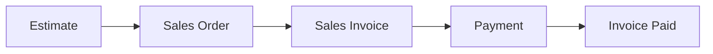
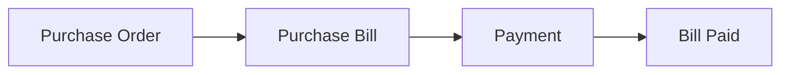

# Idli Book - Complete System Documentation

> **Version**: 0.0.1  
> **Last Updated**: January 11, 2026  
> **Platform**: Frappe Framework v15

---

## Table of Contents

1. [Module Overview](#1-module-overview)
2. [DocTypes Reference](#2-doctypes-reference)
3. [Reports Documentation](#3-reports-documentation)
4. [Workspaces Guide](#4-workspaces-guide)
5. [Chart of Accounts](#5-chart-of-accounts)
6. [APIs & Features](#6-apis--features)
7. [Tax & Calculations](#7-tax--calculations)
8. [Workflows](#8-workflows)

---

## 1. Module Overview

Idli Book is a minimal yet powerful accounting application built on the Frappe Framework. It provides essential features for managing sales, purchases, inventory, and accounts without the complexity of full-featured ERP systems.

### Core Modules

| Module | Purpose | Key Features |
|--------|---------|--------------|
| **Sales** | Manage customer transactions | Estimates, Sales Orders, Sales Invoices |
| **Purchase** | Handle vendor transactions | Purchase Orders, Purchase Bills |
| **Inventory** | Track stock levels | Item management, stock tracking |
| **Accounting** | Financial management | Chart of Accounts, Journal Entries, GL |
| **Payments** | Payment processing | UPI QR Codes, Payment tracking |
| **Reports** | Business intelligence | Financial & operational reports |

---

## 2. DocTypes Reference

### 2.1 Master Data DocTypes

#### IB Organization
**Purpose**: Single DocType storing organization-level settings and defaults.

| Field Name | Type | Purpose | Links To |
|------------|------|---------|----------|
| `organization_name` | Data | Company name | - |
| `gstin` | Data | GST Number | - |
| `address_line1` | Data | Address | - |
| `address_line2` | Data | Address continuation | - |
| `city` | Data | City | - |
| `state` | Link | State | IB State |
| `country` | Link | Country | Country (Frappe) |
| `pincode` | Data | PIN Code | - |
| `email` | Data | Organization email | - |
| `phone` | Data | Contact number | - |
| `base_currency` | Link | Default currency | Currency (Frappe) |
| `financial_year_start` | Date | FY start date | - |
| `financial_year_end` | Date | FY end date | - |
| `default_receivable_account` | Link | AR default | IB Chart of Accounts |
| `default_payable_account` | Link | AP default | IB Chart of Accounts |
| `default_income_account` | Link | Income default | IB Chart of Accounts |
| `default_expense_account` | Link | Expense default | IB Chart of Accounts |
| `default_bank_account` | Link | Bank default | IB Chart of Accounts |

**Key Features**:
- Single record for entire organization
- Provides defaults for all financial transactions
- Links to master Chart of Accounts

---

#### IB Customer
**Purpose**: Store customer master data and defaults.

| Field Name | Type | Purpose | Links To |
|------------|------|---------|----------|
| `customer_name` | Data | Customer display name | - |
| `email` | Data | Contact email | - |
| `phone` | Data | Phone number | - |
| `gstin` | Data | Customer GST number | - |
| `billing_address` | Text | Billing address | - |
| `shipping_address` | Text | Shipping address (if different) | - |
| `city` | Data | City | - |
| `state` | Link | State | IB State |
| `pincode` | Data | PIN Code | - |
| `default_receivable_account` | Link | Customer AR account | IB Chart of Accounts |
| `credit_limit` | Currency | Maximum credit allowed | - |
| `payment_terms` | Data | Payment terms | - |

**Auto-Creation Feature**:
- When saved, automatically creates a dedicated receivable account: `[Customer Name] - Receivable`
- Links this account to the customer record

---

#### IB Vendor
**Purpose**: Store vendor/supplier master data.

| Field Name | Type | Purpose | Links To |
|------------|------|---------|----------|
| `vendor_name` | Data | Vendor display name | - |
| `email` | Data | Contact email | - |
| `phone` | Data | Phone number | - |
| `gstin` | Data | Vendor GST number | - |
| `address` | Text | Vendor address | - |
| `city` | Data | City | - |
| `state` | Link | State | IB State |
| `pincode` | Data | PIN Code | - |
| `default_payable_account` | Link | Vendor AP account | IB Chart of Accounts |
| `payment_terms` | Data | Payment terms | - |

**Auto-Creation Feature**:
- Creates dedicated payable account: `[Vendor Name] - Payable`
- Auto-links to vendor record

---

#### IB Item
**Purpose**: Product/Service master with inventory tracking.

| Field Name | Type | Purpose | Links To |
|------------|------|---------|----------|
| `item_name` | Data | Product/service name | - |
| `item_code` | Data | Unique identifier | - |
| `description` | Text | Item description | - |
| `item_type` | Select | Product/Service | - |
| `track_inventory` | Check | Enable stock tracking | - |
| `current_stock` | Float | Available quantity | - |
| `reorder_level` | Float | Low stock alert level | - |
| `unit_of_measurement` | Data | UOM (pcs, kg, etc.) | - |
| `standard_rate` | Currency | Selling price | - |
| `purchase_rate` | Currency | Buy price | - |
| `hsn_code` | Link | HSN/SAC code | IB HSN Code |
| `tax_rate` | Float | Applicable GST % | - |
| `is_active` | Check | Active status | - |

**Inventory Tracking**:
- Stock updated on Sales Invoice/Purchase Bill submission
- Debit Note/Credit Note reverse stock movements

---

### 2.2 Transaction DocTypes

#### IB Estimate
**Purpose**: Quotation/Proforma invoice for customers.

| Field Name | Type | Purpose | Links To |
|------------|------|---------|----------|
| `customer` | Link | Customer | IB Customer |
| `estimate_date` | Date | Quote date | - |
| `valid_till` | Date | Validity period | - |
| `status` | Select | Draft/Sent/Converted | - |
| `items` | Table | Line items | IB Invoice Item |
| `subtotal` | Currency | Pre-tax total | - |
| `tax_total` | Currency | Total tax | - |
| `grand_total` | Currency | Final amount | - |
| `notes` | Text | Terms & conditions | - |

**Status Flow**: Draft → Sent → Converted to Sales Order

---

#### IB Sales Order
**Purpose**: Confirmed customer order.

| Field Name | Type | Purpose | Links To |
|------------|------|---------|----------|
| `customer` | Link | Customer | IB Customer |
| `order_date` | Date | SO date | - |
| `delivery_date` | Date | Expected delivery | - |
| `status` | Select | Draft/Confirmed/Billed | - |
| `items` | Table | Line items | IB Invoice Item |
| `subtotal` | Currency | Pre-tax total | - |
| `tax_total` | Currency | Total tax | - |
| `grand_total` | Currency | Final amount | - |
| `estimate` | Link | Source estimate (optional) | IB Estimate |

**Status Flow**: Draft → Confirmed → Billed (via Sales Invoice)

---

#### IB Sales Invoice
**Purpose**: Final bill to customer with accounting integration.

| Field Name | Type | Purpose | Links To |
|------------|------|---------|----------|
| `customer` | Link | Customer | IB Customer |
| `invoice_date` | Date | Invoice date | - |
| `due_date` | Date | Payment due date | - |
| `status` | Select | Draft/Submitted/Paid/Partial | - |
| `items` | Table | Line items | IB Invoice Item |
| `subtotal` | Currency | Pre-tax total | - |
| `tax_total` | Currency | Total tax | - |
| `grand_total` | Currency | Final amount | - |
| `paid_amount` | Currency | Amount received | - |
| `outstanding_amount` | Currency | Balance due | - |
| `sales_order` | Link | Source SO (optional) | IB Sales Order |
| `email_delivery_status` | Data | Email sent status | - |

**Key Features**:
- Creates GL entries on submission (DR: AR, CR: Income + Tax)
- Updates stock for tracked items
- Sends email with UPI payment link
- Auto-updates status based on payments

---

#### IB Purchase Order
**Purpose**: Order placed with vendor.

| Field Name | Type | Purpose | Links To |
|------------|------|---------|----------|
| `vendor` | Link | Vendor | IB Vendor |
| `order_date` | Date | PO date | - |
| `delivery_date` | Date | Expected delivery | - |
| `status` | Select | Draft/Confirmed/Billed | - |
| `items` | Table | Line items | IB Purchase Item |
| `subtotal` | Currency | Pre-tax total | - |
| `tax_total` | Currency | Total tax | - |
| `grand_total` | Currency | Final amount | - |

---

#### IB Purchase Bill
**Purpose**: Vendor invoice with accounting integration.

| Field Name | Type | Purpose | Links To |
|------------|------|---------|----------|
| `vendor` | Link | Vendor | IB Vendor |
| `bill_date` | Date | Bill date | - |
| `due_date` | Date | Payment due date | - |
| `status` | Select | Status | - |
| `items` | Table | Line items | IB Purchase Item |
| `subtotal` | Currency | Pre-tax total | - |
| `tax_total` | Currency | Total tax | - |
| `grand_total` | Currency | Final amount | - |
| `paid_amount` | Currency | Amount paid | - |
| `outstanding_amount` | Currency | Balance | - |
| `purchase_order` | Link | Source PO (optional) | IB Purchase Order |

**Key Features**:
- Creates GL entries: DR: Expense + Tax, CR: AP
- Updates stock for tracked items

---

### 2.3 Accounting DocTypes

#### IB Chart of Accounts
**Purpose**: Ledger account master.

| Field Name | Type | Purpose | Links To |
|------------|------|---------|----------|
| `account_name` | Data | Account name (also ID) | - |
| `account_number` | Data | Account code | - |
| `account_type` | Select | Asset/Liability/Income/Expense/etc. | - |
| `root_type` | Select | Balance Sheet / P&L | - |
| `is_group` | Check | Group/Ledger | - |
| `parent_account` | Link | Parent group | IB Chart of Accounts |

**Account Types**:
- Asset, Liability, Equity, Income, Expense
- Bank, Cash, Receivable, Payable
- Tax

**Auto-Creation**:
- Customer receivable accounts
- Vendor payable accounts

---

#### IB GL Entry
**Purpose**: General ledger transaction record.

| Field Name | Type | Purpose | Links To |
|------------|------|---------|----------|
| `posting_date` | Date | Transaction date | - |
| `account` | Link | Account affected | IB Chart of Accounts |
| `debit` | Currency | Debit amount | - |
| `credit` | Currency | Credit amount | - |
| `voucher_type` | Link | Source DocType | - |
| `voucher_no` | Dynamic Link | Source document | - |
| `remarks` | Text | Description | - |
| `is_cancelled` | Check | Reversal flag | - |

**Created By**:
- Sales Invoice
- Purchase Bill
- Payment Entry
- Journal Entry
- Debit/Credit Notes

---

#### IB Payment
**Purpose**: Customer/Vendor payment record.

| Field Name | Type | Purpose | Links To |
|------------|------|---------|----------|
| `payment_type` | Select | Receive/Pay | - |
| `party_type` | Select | Customer/Vendor | - |
| `party` | Dynamic Link | Customer/Vendor | IB Customer/Vendor |
| `payment_date` | Date | Payment date | - |
| `amount` | Currency | Payment amount | - |
| `mode_of_payment` | Select | Cash/Bank/UPI | - |
| `reference_no` | Data | Cheque/UTR number | - |
| `paid_from_account` | Link | Source account (for Pay) | IB Chart of Accounts |
| `paid_to_account` | Link | Destination account (for Receive) | IB Chart of Accounts |
| `references` | Table | Invoice allocations | IB Payment Reference |

**Key Features**:
- Creates GL entries: DR/CR based on payment type
- Updates invoice `paid_amount` and `outstanding_amount`
- Updates invoice status (Paid/Partially Paid)

---

#### IB Journal Entry
**Purpose**: Manual accounting adjustments.

| Field Name | Type | Purpose | Links To |
|------------|------|---------|----------|
| `posting_date` | Date | JE date | - |
| `voucher_type` | Select | Journal Entry type | - |
| `accounts` | Table | Account entries | IB Journal Entry Account |
| `total_debit` | Currency | Sum of debits | - |
| `total_credit` | Currency | Sum of credits | - |
| `remarks` | Text | Description | - |

**Child Table (IB Journal Entry Account)**:
- `account`: Link to IB Chart of Accounts
- `debit`: Debit amount
- `credit`: Credit amount

---

#### IB Debit Note / IB Credit Note
**Purpose**: Sales/Purchase returns.

**Debit Note** (Purchase Return):
- Reverses Purchase Bill
- Reduces payable
- Reverses stock (if tracked)

**Credit Note** (Sales Return):
- Reverses Sales Invoice
- Reduces receivable  
- Reverses stock (if tracked)

---

### 2.4 Configuration DocTypes

#### IB Payment Settings
**Purpose**: Payment gateway and UPI configuration.

| Field Name | Type | Purpose |
|------------|------|---------|
| `enable_payment_gateway` | Check | Enable Razorpay |
| `razorpay_key_id` | Data | API Key |
| `razorpay_key_secret` | Password | API Secret |
| `enable_upi_qr` | Check | Enable UPI QR |
| `upi_id` | Data | UPI VPA |
| `payee_name` | Data | UPI payee name |

---

#### IB Tax
**Purpose**: Tax rate master (CGST, SGST, IGST).

| Field Name | Type | Purpose |
|------------|------|---------|
| `tax_name` | Data | Tax name |
| `tax_rate` | Float | Tax percentage |
| `account` | Link | Tax GL account |

---

#### IB State
**Purpose**: State master for GST (CGST+SGST vs IGST logic).

| Field Name | Type | Purpose |
|------------|------|---------|
| `state_name` | Data | State name |
| `state_code` | Data | GST state code |

---

#### IB HSN Code / IB SAC Code
**Purpose**: HSN/SAC code masters for GST compliance.

---

### 2.5 Child Table DocTypes

#### IB Invoice Item
**Child of**: Estimate, Sales Order, Sales Invoice

| Field Name | Type | Purpose | Links To |
|------------|------|---------|----------|
| `item` | Link | Product/Service | IB Item |
| `description` | Text | Item description | - |
| `quantity` | Float | Qty | - |
| `rate` | Currency | Unit price | - |
| `amount` | Currency | Line total (qty × rate) | - |
| `tax_rate` | Float | GST % | - |
| `tax_amount` | Currency | Tax value | - |

---

#### IB Purchase Item
**Child of**: Purchase Order, Purchase Bill

Similar to IB Invoice Item, tailored for purchase documents.

---

#### IB Payment Reference
**Child of**: IB Payment

| Field Name | Type | Purpose | Links To |
|------------|------|---------|----------|
| `reference_doctype` | Link | Invoice type | DocType |
| `reference_name` | Dynamic Link | Invoice ID | Sales Invoice/Purchase Bill |
| `allocated_amount` | Currency | Payment allocation | - |
| `outstanding_amount` | Currency | Invoice balance | - |

---

## 3. Reports Documentation

### 3.1 Financial Reports

#### IB Profit and Loss
- **Type**: Script Report
- **Purpose**: Income Statement
- **Columns**: Account, Debit, Credit, Balance
- **Filters**: From Date, To Date
- **Logic**: Summarizes Income and Expense accounts

---

#### IB Balance Sheet
- **Type**: Script Report
- **Purpose**: Financial position statement
- **Columns**: Account, Amount
- **Filters**: As On Date
- **Logic**: Assets = Liabilities + Equity

---

#### IB Trial Balance
- **Type**: Script Report  
- **Purpose**: Account-wise debit/credit summary
- **Columns**: Account, Opening, Debit, Credit, Closing
- **Filters**: From Date, To Date

---

### 3.2 Sales Reports

#### IB Sales Invoice Status
- **Type**: Query Report
- **Purpose**: Invoice tracking
- **Columns**: Invoice, Customer, Date, Amount, Paid, Outstanding, Status
- **Summary**: Total Outstanding

---

#### IB Estimate Status
- **Type**: Query Report
- **Purpose**: Quote tracking
- **Columns**: Estimate, Customer, Date, Amount, Status, Valid Till

---

#### IB Best Selling Product
- **Type**: Script Report
- **Purpose**: Top-selling items
- **Columns**: Item, Qty Sold, Revenue
- **Filters**: From Date, To Date

---

#### IB Customer Payment Status
- **Type**: Query Report
- **Purpose**: AR aging
- **Columns**: Customer, Total Invoiced, Paid, Outstanding

---

### 3.3 Purchase Reports

#### IB Purchase Order Status
- **Type**: Query Report
- **Purpose**: PO tracking
- **Columns**: PO, Vendor, Date, Amount, Status

---

#### IB Purchase Bill Status
- **Type**: Query Report
- **Purpose**: Bill tracking
- **Columns**: Bill, Vendor, Date, Amount, Paid, Outstanding, Status

---

#### IB Vendor Payment Status
- **Type**: Query Report
- **Purpose**: AP aging
- **Columns**: Vendor, Total Billed, Paid, Outstanding

---

#### IB Total Purchased Products
- **Type**: Query Report
- **Purpose**: Purchase analysis
- **Columns**: Item, Qty Purchased, Total Cost

---

### 3.4 Inventory Reports

#### IB Inventory Tracked Items
- **Type**: Query Report
- **Purpose**: Current stock levels
- **Columns**: Item, UOM, Stock, Reorder Level

---

#### IB Low Stock Items
- **Type**: Query Report
- **Purpose**: Reorder alerts
- **Columns**: Item, Current Stock, Reorder Level
- **Filter**: Stock < Reorder Level

---

### 3.5 Summary Reports (Number Cards)

- **IB Total Customers**: Customer count
- **IB Total Vendors**: Vendor count
- **IB Total Items**: Item count
- **IB Total Estimates**: Estimate count
- **IB Total Sales Orders**: SO count
- **IB Total Income**: Revenue total
- **IB Total Expenses**: Expense total
- **IB Total Receivables**: AR total
- **IB Total Amount Payable**: AP total
- **IB Top 5 Expenses**: Expense breakdown

---

## 4. Workspaces Guide

### Idli Book (Main)
- **Purpose**: Central dashboard
- **Quick Access**: Recent transactions, shortcuts
- **Charts**: Revenue, Expenses

### Sales
- **Shortcuts**: Estimate, Sales Order, Sales Invoice, Customer
- **Reports**: Sales Invoice Status, Customer Payment Status

### Purchase
- **Shortcuts**: Purchase Order, Purchase Bill, Vendor
- **Reports**: Purchase Bill Status, Vendor Payment Status

### Items
- **Shortcuts**: New Item
- **Reports**: Inventory, Low Stock

### Payment / Receive / Pay
- **Shortcuts**: Record Payment, Record Receipt
- **Reports**: Payment tracking

### Customers / Vendors
- **Shortcuts**: Add new
- **Reports**: Aging, payment status

### Bills / Purchase Orders / Sales Invoices / Sales Orders / Estimates
- **Purpose**: Dedicated transaction views
- **Features**: List view, filters, bulk actions

---

## 5. Chart of Accounts

### Account Structure

```
Root
├── Assets
│   ├── Current Assets
│   │   ├── Cash
│   │   ├── Bank Accounts
│   │   └── Accounts Receivable
│   │       └── [Customer Name] - Receivable (auto-created)
│   └── Fixed Assets
├── Liabilities
│   ├── Current Liabilities
│   │   ├── Accounts Payable
│   │   │   └── [Vendor Name] - Payable (auto-created)
│   │   └── Tax Payable
│   │       ├── CGST Payable
│   │       ├── SGST Payable
│   │       └── IGST Payable
│   └── Long-term Liabilities
├── Equity
│   └── Opening Balance Equity
├── Income
│   ├── Sales Income
│   └── Other Income
└── Expense
    ├── Cost of Goods Sold
    ├── Operating Expenses
    └── Tax Expenses
```

### Auto-Created Accounts

#### Customer Receivable Accounts
- **Format**: `[Customer Name] - Receivable`
- **Created**: On customer save
- **Type**: Receivable (Asset)
- **Linked to**: Customer record

#### Vendor Payable Accounts
- **Format**: `[Vendor Name] - Payable`
- **Created**: On vendor save
- **Type**: Payable (Liability)
- **Linked to**: Vendor record

### Default Accounts (IB Organization)

| Setting | Purpose | Example |
|---------|---------|---------|
| Default Receivable | AR for customers without specific account | Accounts Receivable |
| Default Payable | AP for vendors without specific account | Accounts Payable |
| Default Income | Revenue recognition | Sales Income |
| Default Expense | Expense recognition | Operating Expenses |
| Default Bank Account | Payment processing | Main Bank Account |

---

## 6. APIs & Features

### 6.1 UPI QR Code Payment

**Implementation**: `invoice_payment.py`, `invoice_payment.html`

**Flow**:
1. Customer receives invoice email with "Pay Now" button
2. Clicks button → Opens `/invoice_payment?invoice=INV-001`
3. Page generates dynamic UPI QR code:
   ```
   upi://pay?pa={upi_id}&pn={payee_name}&tr={invoice_name}&tn=Invoice {invoice_name}&am={amount}&cu=INR
   ```
4. Customer scans with any UPI app (GPay, PhonePe, etc.)
5. Payment pre-filled, customer completes

**Configuration** (IB Payment Settings):
- Enable UPI QR Code: ✓
- UPI ID (VPA): `business@okicici`
- Payee Name: `Your Company Name`

**Dependencies**:
- Python library: `qrcode[pil]`
- Install: `./env/bin/pip install qrcode[pil]`

**Code Reference**:
```python
# Generate QR
upi_uri = f"upi://pay?pa={upi_id}&pn={payee_name}&tr={invoice.name}&tn=Invoice {invoice.name}&am={amount}&cu=INR"
qr = qrcode.QRCode(version=1, box_size=10, border=4)
qr.add_data(upi_uri)
qr.make(fit=True)
img = qr.make_image(fill_color="black", back_color="white")
```

---

### 6.2 Razorpay Integration (Optional)

**Implementation**: `api.py`, `pay.html`, `pay.py`

**APIs**:
- `get_payment_details(invoice_name)`: Fetch invoice info
- `create_razorpay_order(invoice_name)`: Create payment order
- `verify_payment(...)`: Verify signature & record payment

**Configuration**:
- Enable Payment Gateway: ✓
- Razorpay Key ID: `rzp_test_...`
- Razorpay Key Secret: `***`

---

### 6.3 Email Features

**Auto-Email on Invoice Submission**:
```python
def send_invoice_email(self):
    customer_email = frappe.db.get_value("IB Customer", self.customer, "email")
    # Validate email
    # Include payment link if UPI enabled
    # Attach PDF
    frappe.sendmail(...)
```

**Features**:
- Email validation
- PDF attachment
- UPI payment link (if enabled)
- Status tracking (`email_delivery_status`)

---

### 6.4 API Endpoints

| Endpoint | Method | Purpose |
|----------|--------|---------|
| `/api/method/idli_book.idli_book.api.get_payment_details` | GET | Invoice details |
| `/api/method/idli_book.idli_book.api.create_razorpay_order` | POST | Create order |
| `/api/method/idli_book.idli_book.api.verify_payment` | POST | Verify payment |

---

## 7. Tax & Calculations

### 7.1 GST Logic

**Same State**: CGST + SGST
**Interstate**: IGST

**Tax Rates**:
- 18% = 9% CGST + 9% SGST (same state)
- 18% = 18% IGST (interstate)

### 7.2 Sales Invoice Calculation

**Example**:

| Item | Qty | Rate | Amount | Tax Rate | Tax Amount |
|------|-----|------|--------|----------|------------|
| Product A | 2 | ₹1,000 | ₹2,000 | 18% | ₹360 |
| Service B | 1 | ₹500 | ₹500 | 18% | ₹90 |

**Calculation**:
```
Subtotal = ₹2,500
CGST @ 9% = ₹225
SGST @ 9% = ₹225
Grand Total = ₹2,950
```

**GL Entries (Same State)**:
```
DR Accounts Receivable - Customer A    ₹2,950
   CR Sales Income                              ₹2,500
   CR CGST Payable                              ₹225
   CR SGST Payable                              ₹225
```

**GL Entries (Interstate)**:
```
DR Accounts Receivable - Customer A    ₹2,950
   CR Sales Income                              ₹2,500
   CR IGST Payable                              ₹450
```

### 7.3 Purchase Bill Calculation

**GL Entries**:
```
DR Cost of Goods Sold                  ₹2,500
DR CGST Paid                           ₹225
DR SGST Paid                           ₹225
   CR Accounts Payable - Vendor X              ₹2,950
```

### 7.4 Payment Entry

**Customer Payment (Receive)**:
```
DR Bank Account                        ₹2,950
   CR Accounts Receivable - Customer A         ₹2,950
```

**Vendor Payment (Pay)**:
```
DR Accounts Payable - Vendor X         ₹2,950
   CR Bank Account                             ₹2,950
```

---

## 8. Workflows

### 8.1 Sales Workflow



**Detailed Flow**:

1. **Create Estimate**
   - Add customer
   - Add items
   - Submit
   - Send email

2. **Convert to Sales Order**
   - Create from Estimate (optional)
   - Or create directly
   - Confirm order

3. **Create Sales Invoice**
   - Create from SO (optional)
   - Or create directly
   - Submit → GL entries created
   - Stock reduced
   - Email sent with UPI link

4. **Record Payment**
   - Customer pays via UPI/Bank
   - Create Payment Entry
   - Allocate to invoice
   - Submit → GL entries created
   - Invoice status updated

### 8.2 Purchase Workflow



**Detailed Flow**:

1. **Create Purchase Order**
   - Add vendor
   - Add items
   - Submit

2. **Create Purchase Bill**
   - Create from PO (optional)
   - Submit → GL entries
   - Stock increased

3. **Make Payment**
   - Create Payment Entry (Pay)
   - Allocate to bill
   - Submit → GL entries
   - Bill status updated

### 8.3 Payment Workflow

**Customer Payment**:
1. Customer → Sales Invoice created
2. Email sent with UPI QR link
3. Customer scans → Pays
4. Record Payment Entry (manually or via Razorpay webhook)
5. Invoice marked Paid

**Vendor Payment**:
1. Vendor → Purchase Bill created
2. Due date tracking
3. Create Payment Entry before/on due date
4. Bill marked Paid

### 8.4 Accounting Workflow

**Month-End Close**:
1. Run Trial Balance
2. Verify balances
3. Check Profit & Loss
4. Review Balance Sheet
5. Journal entries for adjustments (if needed)

---

## Appendix: Installation & Setup

### Prerequisites
- Frappe v15
- Python 3.10+
- MariaDB/PostgreSQL

### Installation
```bash
bench get-app https://github.com/your-repo/idli_book
bench --site site1.local install-app idli_book
bench --site site1.local migrate
```

### Initial Setup
1. **IB Organization**: Configure company details
2. **Chart of Accounts**: Review/customize
3. **Customers & Vendors**: Import master data
4. **Items**: Add products/services
5. **Payment Settings**: Configure UPI/Gateway

### Library Dependencies
```bash
cd /path/to/frappe-bench
./env/bin/pip install qrcode[pil]
```

---

## Support & Resources

- **Documentation**: This file
- **Issue Tracker**: GitHub Issues
- **Email**: support@idlibook.com

---

**End of Documentation**
